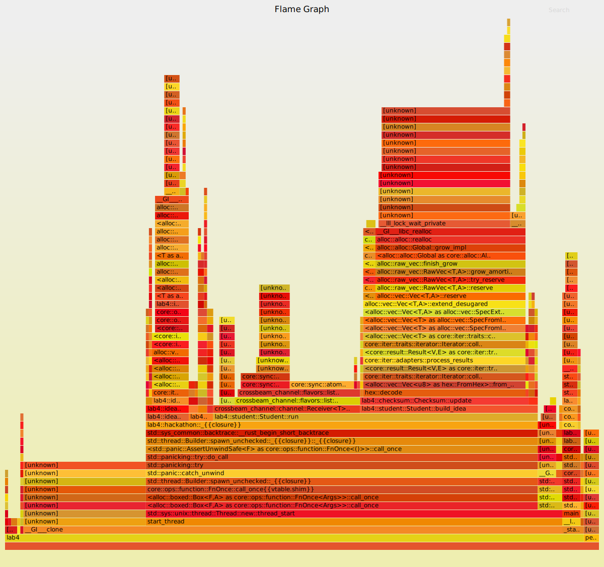

# Title

Optimizing performance by reducing repeated code done in threads.

# Summary

There are several areas in the original code that are blocking and are executed numourous times in each thread. Such areas include file I/O, string manipulation and mutex locking.
By reducing the number of times these long-blocking functions are called, while still maintaining the same functionality, we are able to improve the performance.

# Technical details

The first optimization I did was just by going through the codebase, and I found out that reading text files was executed many times in each thread. Since each file contains constant
data that are shared across the whole program, it is intuitive to move the file I/O into `main.rs` and pass down the data to each component file. However, the improvement of this was
not very noticeable.

The next thing I tried was looking at the flamegraph, after which I found the program spending a large amount of time on `string::Lines` function. My guess was that this function may
be computational expensive, so it needs to be called as rarely as possible. Then I changed it to be called once per thread initialization (in the constructor), and then the performance
improvement was huge. By looking at the flamegraph, the time spent on `string::Lines` was significantly reudced.

The flamegraph also suggested that a lot of time was spent on `Mutex.lock`, so I started looking for where mutex is being locked. Such places were placed in loops which was executed
many times in each thread, and this can be optimized too, by having a temporary variable in a thread, and updating the shared mutex after the loop is done. This reduced the time spent
on mutex by a lot. However, all the changes made up to now only optimized `package::run` and `ideaGenerator::run`, time spent on `student::run` is still huge.

The hardest part is to optimize `student::run`, because the mutex trick didn't work here. In order to reduce the time spent on `crossbeam` I tried using more channels, and it seemed
to reduce the execution by around 5ms. This is because by have 3 channels in parallel the `run` was able to process 3 types of events at most in each run, thus being faster in general.

# Testing for correctness

The correctness is verified by running the program in release mode by using `cargo run --release`, and seeing the global checksum being the same. For example `Idea Generator` should equal
`Student Idea` and `Package Downloader` should equal `Student package`.

# Testing for performance.

Flamegraph is a tool to help identify which function call takes long to run. For example, we see that `string::Lines` takes a large amount of time initially, and we know that we should call
it as rarely as possible. For example, if we made the optimization in `package.rs` then on flamegraph, `package::run` should take a lot less time, and this is because `string::Lines` is not
blocking `pacakge::run` from finishing. We can do that for other areas optimizations as well, and the bars on flamegraph should be shorter (better).

However, the overall performance can only be quantitatively measured by running `hyperfine --min-runs 100 -i target/release/lab4`. The initial time was around 320ms, and after each optimization
I've made, the time reduced a bit, which means that particular optimization was indeed useful. The final time was around 23ms, improving the performance by **13.9** times.

Finally, the final flamegraph is shown here. We can see comparing to the initial flamegraph, `idea` and `package` are greatly optimized, as seen the flamegraph block is extremely small. However, `student` is still pretty big, but reduced significantly comparing to the initial one.

